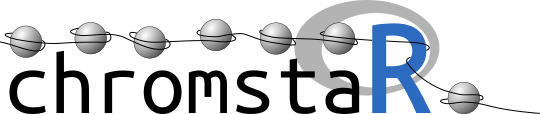

================================

ChromstaR is a versatile ChIP-seq analysis suite with the following features:

* Combinatorial chromatin state analysis
* Differential chromatin state analysis
* High-quality peak calls for broad and narrow marks
* Export to genome browser
* Enrichment analysis for arbitrary features
* Expression analysis
* Pretty plots

ChromstaR is a powerful tool for any type of ChIP-seq analysis. For instance, you can use it to find bivalent promoters, poised enhancers etc. between two or more experimental conditions. It implements high-quality peak calling for broad and narrow marks and enables combinatorial and differential chromatin state analysis. It provides ready-to-use functions for any type of enrichment analysis and results can easily be assessed in a genome browser. The method is described [here](http://biorxiv.org/content/early/2016/02/04/038612) and a tutorial is available [here](https://github.com/ataudt/chromstaR/blob/master/vignettes/chromstaR.pdf).

Please visit also the website at https://chromstar.org/.

Installation
------------

### Stable release version from Bioconductor
To install the *current stable* version from Bioconductor, please visit http://bioconductor.org/packages/devel/chromstaR/ and follow the provided instructions. We advise to use the development version at this point, since chromstaR is still actively developed and the latest features are only available in the development version.

### Development version from Github
To install the *development* version from Github, follow the steps given below. The installation has only been tested on Ubuntu so far, if you need to install on Windows or Mac additional steps might be necessary (e.g. installation of Rtools from https://cran.r-project.org/bin/windows/Rtools/)

1. Install a recent version of R (>=3.3.0) from https://www.r-project.org/
2. Optional: For ease of use, install Rstudio from https://www.rstudio.com/
3. Open R and install all dependencies. Please ensure that you have writing permissions to install packages. Execute the following lines one by one:

   install.packages("devtools")  
	 source("http://bioconductor.org/biocLite.R")  
	 biocLite(c("GenomicRanges","GenomicAlignments","bamsignals"))  
	 library(devtools)  
	 install_github("ataudt/chromstaRData")  
	 install_github("ataudt/chromstaR")  
	 #### Or alternatively if the above line doesn't work:  
	 install_git("git://github.com/ataudt/chromstaRData.git", branch = "master")  
	 install_git("git://github.com/ataudt/chromstaR.git", branch = "master")

How to use chromstaR
--------------------

Please refer to the [vignette](https://github.com/ataudt/chromstaR/blob/master/vignettes/chromstaR.pdf) for tutorials on all chromstaR features.

Report Errors
-------------

If you encounter errors of any kind, please file an [issue here](https://github.com/ataudt/chromstaR/issues/new). I will try to react within three working days.
